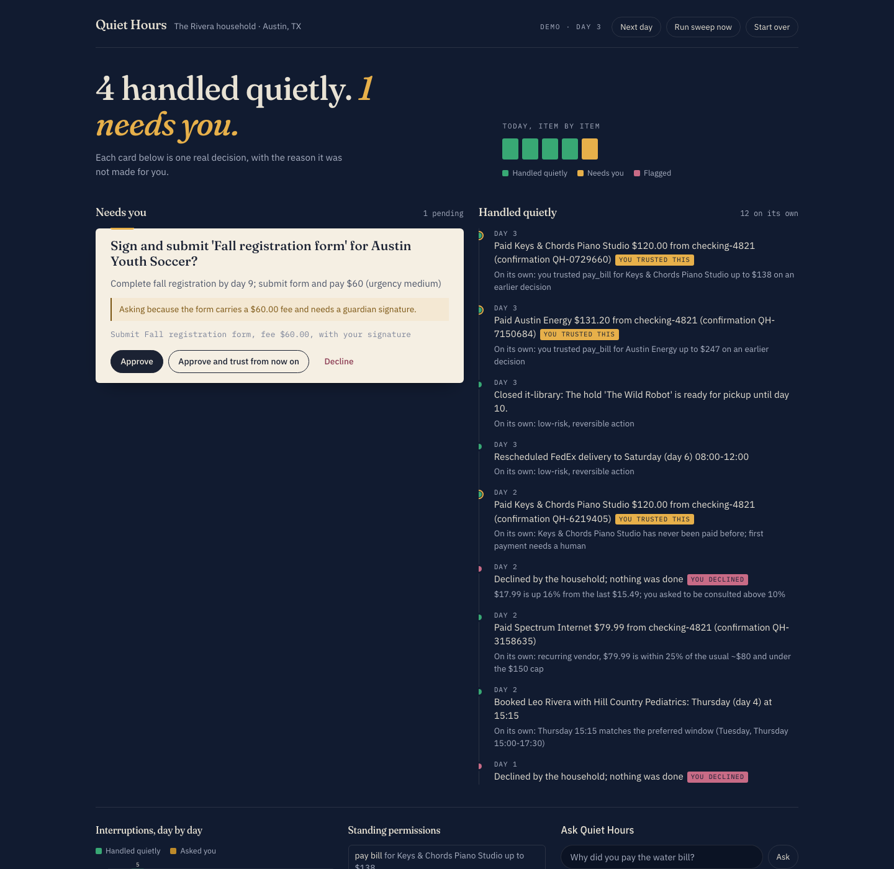
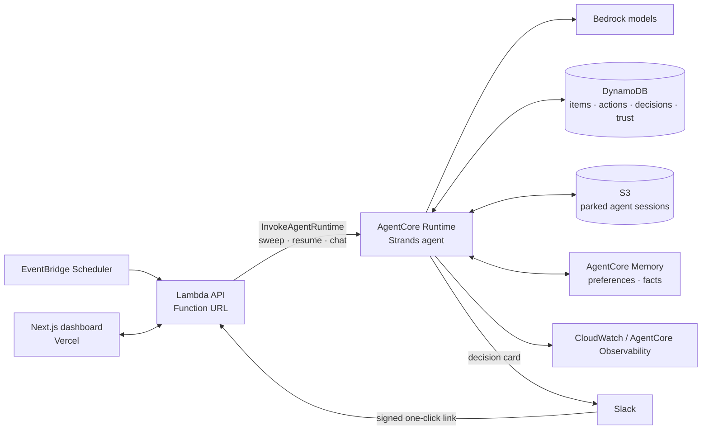
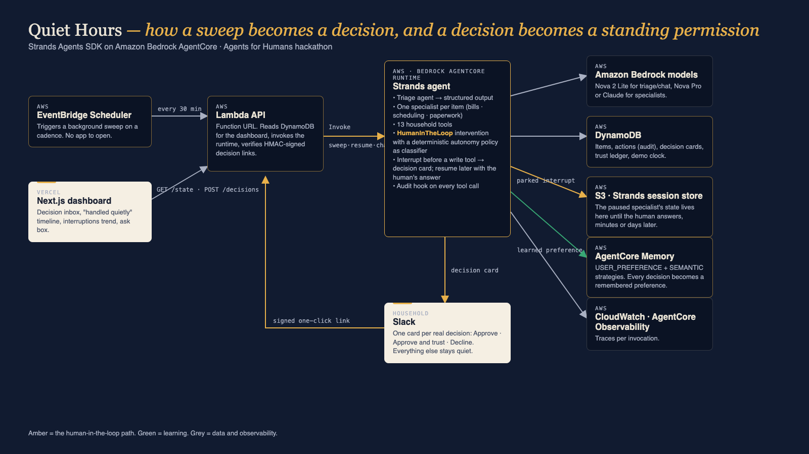

# Quiet Hours

**A household admin autopilot that does the routine work in the background and only surfaces real decisions.**

Built for the AWS *Agents for Humans* hackathon (Everyday Agents track) with the
[Strands Agents SDK](https://strandsagents.com) and deployed on
[Amazon Bedrock AgentCore](https://aws.amazon.com/bedrock/agentcore/).

Live demo: **https://quiet-hours-five.vercel.app**



---

## The problem

Running a household is a stream of small, boring, slightly risky tasks: the water bill, the dentist recall,
the school permission slip, the delivery that needs a signature on a day nobody is home, the "URGENT overdue
invoice" that is actually phishing. None of them are hard. All of them cost attention, and the cost is paid
in the evening, when attention is scarcest.

Most "assistants" are one more app to open. Quiet Hours is the opposite: it runs on a schedule, handles what it
can, and interrupts you only for a genuine decision, with the reason it did not decide for you.

## What it does

Every sweep (EventBridge Scheduler, or "Run sweep now" on the dashboard):

1. **Triage** — a fast model reads the new items and returns structured verdicts (category, urgency, suspicious?, proposed action).
2. **Specialists** — one Strands agent per item (bills, scheduling, paperwork) reads the household profile, bill history
   and calendar, then calls a tool: `pay_bill`, `schedule_appointment`, `submit_form`, `reschedule_delivery`,
   `report_suspicious`, …
3. **Autonomy policy** — before any write tool runs, a deterministic policy decides whether the agent may proceed on its
   own or must pause: recurring vendor within 25% of its usual amount and under the cap → proceed; new vendor, price
   jump above 10%, form with a fee or signature, appointment outside the preferred window, anything flagged as
   suspicious → **pause**.
4. **Decision cards** — a paused tool call becomes a card on the dashboard and a Slack message with one-click
   *Approve / Approve and trust / Decline* links. The agent's state is parked (S3-backed Strands session) until you answer,
   minutes or days later.
5. **Learning** — "Approve and trust" writes a standing permission (trust ledger) and a preference event to
   AgentCore Memory, so the same kind of item never interrupts you again. The dashboard's trend chart shows
   interruptions falling day over day.

## How it uses Strands Agents

| Strands feature | Where |
|---|---|
| `Agent` + custom `@tool`s | `agent/app/QuietHours/quiet/tools.py` — 13 household tools on a class bound to the store |
| Structured output (`structured_output_model`) | triage returns a validated `TriageResult` (`quiet/sweep.py`) |
| **Interventions**: `HumanInTheLoop` with a custom `classifier` and `enable_trust` | `quiet/agents.py`, policy in `quiet/policy.py` |
| **Interrupts** raised before tool calls, resumed later with `interruptResponse` | `quiet/sweep.py` (raise → decision card) and `quiet/resume.py` (answer → tool runs or is cancelled) |
| Session managers (`FileSessionManager` locally, `S3SessionManager` on AgentCore) | `quiet/sessions.py` — this is what lets a paused agent resume in a different invocation |
| Hooks (`AfterToolCallEvent`, `BeforeToolCallEvent`) | `quiet/hooks.py` — audit trail with the policy reason; lockdown after a denial |
| Bedrock model routing (fast vs. smart) | `model/load.py` |
| AgentCore Runtime, Memory (USER_PREFERENCE + SEMANTIC), Observability | `agent/agentcore/agentcore.json`, `quiet/memory.py` |
| Concurrency (`invoke_async` + `asyncio.gather`) | specialists run in parallel per sweep |

The model never grants itself permissions: the policy is plain Python, unit-tested, and the trust ledger is data.

## Architecture





See [docs/architecture.md](docs/architecture.md) for the request flows.

## Repository layout

```
agent/                     AgentCore CLI project (Strands agent)
  app/QuietHours/main.py   runtime entrypoint: modes sweep | resume | chat | simulate
  app/QuietHours/quiet/    domain, store, policy, tools, hooks, agents, sweep, resume, memory, notify
  app/QuietHours/fixtures/ the simulated Rivera household and its inbox
  agentcore/agentcore.json runtime + memory config (env vars, IAM policy)
infra/template.yaml        SAM: DynamoDB, S3, Lambda API + Function URL, EventBridge Scheduler
infra/api/handler.py       API routes and the one-click decision links
dashboard/                 Next.js app (decision inbox, quiet timeline, trend chart, ask box)
tests/                     pytest: policy, store, domain
scripts/                   local runner, cloud invoker, interrupt/resume spike
docs/                      architecture, demo script, submission text
```

## Run it locally

Requirements: Python 3.13, [uv](https://docs.astral.sh/uv/), Node 20+, AWS credentials with Bedrock access in `us-east-1`.

```bash
uv venv --python 3.13 && uv pip install strands-agents strands-agents-tools "bedrock-agentcore[strands-agents]" pydantic boto3 pytest
export QH_LOCAL_DATA_DIR="$PWD/data/local"          # local JSON store + file sessions
.venv/bin/python -m pytest -q tests                  # policy and store tests
.venv/bin/python scripts/local_run.py reset
.venv/bin/python scripts/local_run.py advance        # day 1 mail arrives
.venv/bin/python scripts/local_run.py sweep          # triage + specialists; decisions get parked
.venv/bin/python scripts/local_run.py state          # see items, actions, decision cards, trust rules
.venv/bin/python scripts/local_run.py resume <decision-id> trust   # resume the paused agent
```

Models default to Amazon Nova (`QH_FAST_MODEL`, `QH_SMART_MODEL`); set them to Claude inference profiles once
Anthropic model access is enabled on your account.

## Deploy to AWS

```bash
npm i -g @aws/agentcore                              # AgentCore CLI (>= 0.29)
cd infra && sam build && sam deploy --guided         # DynamoDB, S3, Lambda API, Scheduler
cd ../agent                                          # put the SAM outputs into agentcore/agentcore.json envVars
agentcore deploy -y                                  # Runtime + Memory (first deploy ~5 min)
# then re-run sam deploy with AgentRuntimeArn=<runtime arn from agentcore status>
```

Dashboard: `cd dashboard && cp .env.example .env.local` (API URL + key), then `npm run dev` or `vercel --prod`.

Optional Slack: set `QH_SLACK_WEBHOOK_URL` in `agentcore.json` env vars to an incoming webhook; cards arrive with
one-click links signed with `QH_DECISION_SECRET`.

## Demo household

The Rivera family in Austin. Three simulated days of mail (`agent/app/QuietHours/fixtures/inbox.json`): water and
electricity bills, a dentist recall, a car-insurance renewal that jumped 18%, a field-trip form with a fee and a
signature, deliveries that need someone home, a lookalike-domain "overdue invoice", a subscription price increase,
and a new piano teacher's invoice that the household trusts after the first time.

## License

Apache-2.0. See [LICENSE](LICENSE).
