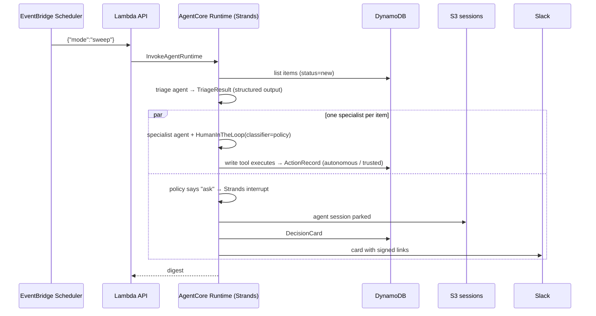

# Architecture

## Components

| Component | Service | Role |
|---|---|---|
| Strands agent (`agent/`) | Amazon Bedrock AgentCore Runtime (CodeZip, Python) | triage, specialists, autonomy policy, interrupts/resume, chat |
| Memory | AgentCore Memory (USER_PREFERENCE + SEMANTIC strategies) | learns what the household decided; recalled by specialists |
| Models | Amazon Bedrock (Nova 2 Lite for triage/chat, Nova Pro for specialists; Claude when enabled) | reasoning and tool selection |
| Store | DynamoDB single table (`PK` = record type, `SK` = id) | items, actions (audit), decision cards, trust rules, demo clock |
| Sessions | S3 (`S3SessionManager`) | parked agent state while a decision waits for a human |
| API | Lambda + Function URL | dashboard backend, one-click Slack links, scheduler target |
| Scheduler | EventBridge Scheduler | background sweeps every 30 minutes |
| Dashboard | Next.js on Vercel | decision inbox, quiet timeline, trend, ask box |
| Notifications | Slack incoming webhook | decision cards with signed Approve / Trust / Decline links |
| Observability | CloudWatch + AgentCore Observability | traces per invocation |

## Flow 1 — a background sweep



## Flow 2 — the human answers

```mermaid
sequenceDiagram
  participant H as Household member
  participant K as Slack / dashboard
  participant L as Lambda API
  participant R as AgentCore Runtime
  participant S3 as S3 sessions
  participant D as DynamoDB
  participant M as AgentCore Memory
  H->>K: taps "Approve and trust"
  K->>L: GET /d/{id}?choice=trust&t=<hmac>
  L->>R: {"mode":"resume","decision_id":…,"choice":"trust"}
  R->>S3: rebuild the same specialist (same session_id)
  R->>R: agent([{interruptResponse: {interruptId, response:"t"}}])
  R->>D: tool executes → ActionRecord (trusted); TrustRule added
  R->>M: create_event("I approved … may pay X without asking")
  L-->>K: 302 → dashboard
```

## Why interrupts instead of a plain approval queue

A Strands interrupt freezes the *exact* tool call the model proposed. On approval the tool runs with those exact
arguments; the model does not get to reason again. That gives a true audit trail (what was proposed, why the policy
paused it, what the human said, what ran) and makes "trust from now on" safe: the trust rule is scoped to the tool,
vendor and amount of the call that was approved.

## Security notes

- Runtime payloads are validated (`mode` enum, `prompt` must be a string) per AgentCore guidance.
- One-click links are HMAC-signed per (decision, choice) and single-use (a resolved decision cannot be resumed again).
- The dashboard talks to the API through a server-side proxy holding the API key; the browser never sees it.
- The payment tool refuses amounts that differ from the bill and refuses items flagged as suspicious, regardless of what the model asked.
